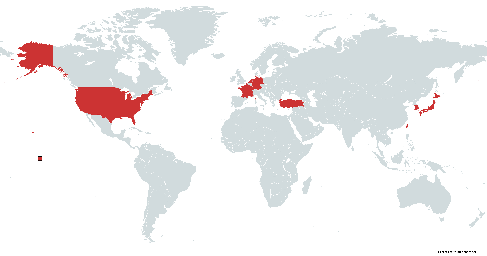

# IW2021 MoqHao

A dataset behind my IW2021 talk.

## Landing page IP addresses

- [Data(CSV)](./lp_ip_addresses.csv)

Note: the data have been collected since 2020/05.

## MoqHao landing pages on 2021/09/19

| Target country | Icon                                                                                      | C2                       | Details                |
|----------------|-------------------------------------------------------------------------------------------|--------------------------|------------------------|
| Japan          |  | 45.114.129.50:28877      | [Link](./jp/README.md) |
| United States  |  | 103.249.28.209:28856     | [Link](./us/README.md) |
| France         |  | 103.249.28.207:28866     | [Link](./fr/README.md) |
| Germany        |  | 92.204.255.170:28843 (?) | [Link](./de/README.md) |
| Turkey         |  | 61.97.248.5:28836 (?)    | [Link](./tr/README.md) |
| Taiwan         |  | 103.249.28.208:38866 (?) | [Link](./tw/README.md) |
| South Korea    | N/A                                                                                       | N/A                      | [Link](./kr/README.md) |

Note: `(?)` means the data is taken on another day. There might be different payloads on the day.
